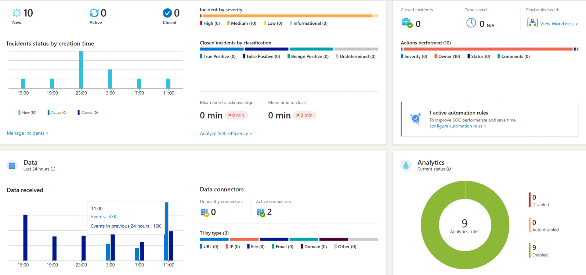

### **About Me**

Cybersecurity professional with extensive experience across multiple domains of cybersecurity and information security. Demonstrated expertise in systems administration, penetration testing, and IT support, delivering robust security solutions and ensuring seamless operations for a diverse client base. Proficient in implementing and documenting compliance controls for frameworks such as NIST, CIS, SOC, GDPR, ISO 27001, and PCI-DSS, leading to successful audits and certifications. Specializes in cloud security with hands-on experience in Microsoft 365 and Apple Business Essentials. Adept at conducting penetration tests on REST API and GraphQL web applications, identifying and addressing vulnerabilities to enhance clients' security posture.

### **Skills**

- **Systems Administration:** Windows, Linux, MacOS, Android, iOS
- **Penetration Testing:** REST API, GraphQL, Web Applications
- **Compliance & Audits:** NIST, CIS, SOC, GDPR, ISO 27001, PCI-DSS
- **Cloud Security:** Microsoft 365, Apple Business Essentials
- **Programming Languages:** Python, Golang, PowerShell
- **Tools:** Wireshark, Burp Suite, FFuF, Hydra, Nmap, Metasploit, JohnTheRipper, Nessus, Gobuster
- **Incident Response & Recovery** Microsoft Defender, Microsoft Sentinel, Jira, Snort, pfSense
- **Identity Access Management** Microsoft Azure Active Directory, Microsoft Entra ID
- **Automation & Scripting** Jira, Python, Golang, PowerShell

### **Experience**

#### **Security Overview (Aug 2023 – July 2024)**
*Dynamic cybersecurity startup focused on securing cloud environments with Microsoft 365 and Apple Business Essentials. Provided IT support and conducted penetration tests for clients. Implemented industry-standard compliance controls to ensure regulatory adherence and successful audits.*

**Role:** Cybersecurity Analyst, Penetration Tester, Systems Administrator

- Delivered comprehensive systems administration, penetration testing, and helpdesk services across Windows, Linux, macOS, iOS, and Android platforms. Managed and maintained system performance, security configurations, and software updates, ensuring seamless and secure operations. Provided technical support for end-users, troubleshooting issues ranging from network connectivity to software installation.
  
- Managed client endpoints and inboxes using Microsoft 365 (e.g., Azure AD/Entra ID, Intune, Exchange, SharePoint, OneDrive, Defender, Teams, Purview) and Apple Business Essentials, including the creation, management, and deletion of user accounts. Strengthened Identity and Access Management (IAM) by implementing SAML/SSO, Multi-factor Authentication (MFA), and enforced geo-restrictions, allowing sign-ins only from authorized locations. Secured Windows and macOS endpoints by encrypting devices with BitLocker and FileVault, ensuring data protection against unauthorized access.
  
- Conducted contract-based and quarterly penetration tests, including REST API and GraphQL web applications. Utilized the OWASP Top 10 framework to identify and assess 30+ server and client-side vulnerabilities, such as DOM-based, stored, and reflected XSS, NoSQL injections, CSRF, open redirect, improper access controls, and other security misconfigurations. Produced detailed penetration test reports for clients, outlining findings, risk levels, and recommended remediation steps. Collaborated closely with clients to follow up on vulnerabilities, providing guidance on remediation and re-testing to ensure issues were effectively resolved.
  
- Developed and implemented compliance controls aligned with NIST, SOC1, SOC2, PCI-DSS, GDPR, ISO 27001, and CIS frameworks, ensuring successful client audits and achieving necessary certifications. Strengthened governance, risk, and compliance (GRC) processes by enhancing cloud environments through data loss prevention strategies and the application of conditional access policies, significantly reducing potential vulnerabilities and ensuring regulatory adherence.

#### **Proof of Reception (May 2023 – Present)**
*Part-time internship focusing on leveraging AI to enhance application development and code quality. Utilized Python, Golang, and React Native for application development.*

**Role:** Prompt Engineer

- Gained experience in the Software Development Lifecycle (SDLC), collaborating effectively within cross-functional teams.
  
- Analyzed and remediated code vulnerabilities to enhance application security.
  
- Optimized code, developed new functions, and created visual content using prompts with AI models like GPT-4, DALL-E 2, and Copilot.
  
- Utilized tools such as ChatGPT, Google Bard, DALL-E 2, Stable Diffusion, and Microsoft Copilot.

### **Education**

#### **Woz-U, Cybersecurity**

- **GPA:** 4.0
  
- Completed a comprehensive cybersecurity program, gaining in-depth knowledge and hands-on experience in penetration testing, cloud security, network security, vulnerability assessment, and secure systems administration. Excelled in practical labs and projects. Created and participated in Capture the Flag (CTF) events, enhancing practical skills. Actively supported fellow classmates, hosted workshops, and earned a place on the Dean's List multiple times for academic excellence.

### **Certifications**

- Woz-U Cybersecurity Certificate of Completion
- Google IT Support Professional
- IBM IT Support Professional
- IBM Cybersecurity Analyst Professional
- (ISC)² Certified in Cybersecurity
- Level 1 Intelligence Analyst Certification
- TryHackMe Advent of Cyber 2023
- The Complete Social Engineering, Phishing, OSINT, & Malware Certification
- Forensic Accounting and Fraud Examination
- OpenAI, GPT, ChatGPT, and DALL-E Masterclass
  

### **Projects**

#### **Microsoft Sentinel SIEM Deployment and Security Operations Center (SOC) Project**
**Description:** Designed and implemented a Security Information and Event Management (SIEM) & Security Operations Center (SOC) using Microsoft Azure and Microsoft Sentinel, focusing on real-time threat detection and incident response.

**Key Components:**

- **Azure Virtual Machine Setup:** Deployed and configured a Windows-based virtual machine with RDP access for monitoring purposes.

- **SIEM Implementation:** Integrated Microsoft Sentinel as a SIEM solution to collect, analyze, and monitor security event logs.

- **Threat Intelligence Integration:** Configured a threat intelligence feed to detect and generate alerts for Indicators of Compromise (IoCs).

- **Event Logging and Alert Configuration:** Established data connectors and created custom alert rules to monitor successful RDP sign-ins and other critical security events.

- **Practical Experience:** Gained hands-on experience with real-time security monitoring, incident detection, and response within a simulated environment.

- **Technologies Used:** Microsoft Azure, Microsoft Sentinel, Log Analytics, Windows Server.

#### **The Office: Doomsday Device CTF Walkthrough**
**Description:** Final project for Woz-U, a walkthrough for a Capture the Flag (CTF) vulnerable machine based on the TV show "The Office". Demonstrates various penetration testing techniques.

##### - [The Office: Doomsday Device Walkthrough PDF](https://github.com/BBennett92/brandonbennett.io/blob/main/images/doomsdayproject.pdf) **CLICK ME FOR WALKTHROUGH PDF!**

**Key Components:**

- **Reconnaissance & Information Gathering:** Utilized Nmap and netdiscover for initial network scanning to identify open ports and active services. Employed Gobuster and FFuF for directory and file enumeration, while leveraging Signal Squirrel to decode the messages encoded in morse code.

- **Vulnerability Analysis:** Analyzed service vulnerabilities using nmap & Wireshark. Inspected ".pcap" files with Wireshark to pinpoint the username and password found in cleartext.

- **Exploitation:** Exploited the identified vulnerabilities using a combination of creedGEN and hydra to brute force entry into the FTP service. Utlized Burp Suite to exploit the Koken CMS using a PHP reverse shell via a arbitrary file upload vulnerability using an image and connecting via netcat, leading to unauthorized access and a foothold on the machine.

- **Privilege Escalation:** Unlocked the SSH port using Knock. Leveraged SSH2John to crack the SSH key, and spawned an interactive shell resulting in privledge escalation. Uploaded "defuse.sh" bash script, resulting in earning the 8th and final flag.

- **Post-Exploitation & Reporting:** Secured sensitive data, maintained access, and documented the entire process with remediation steps and security recommendations.

- **Technologies Used:** Nmap, netdiscover, FFuF, Signal Squirrel, Burp Suite, creedGEN, Wireshark, MySQL, netcat, Exiftool, Knock, cat, nano, Gobuster, ftp, SSH2John, JohnTheRipper, LFTP, Hydra.

### **Contact Me**

Feel free to reach out to me if you'd like to discuss cybersecurity opportunities or any of the projects I've worked on. You can contact me via email or connect with me on LinkedIn using the links provided below.

- [https://www.linkedin.com/in/brandon-bennett~/](https://www.linkedin.com/in/brandon-bennett~/) 
- ### **bb.sec.op@protonmail.com** 

---
