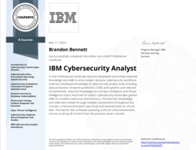
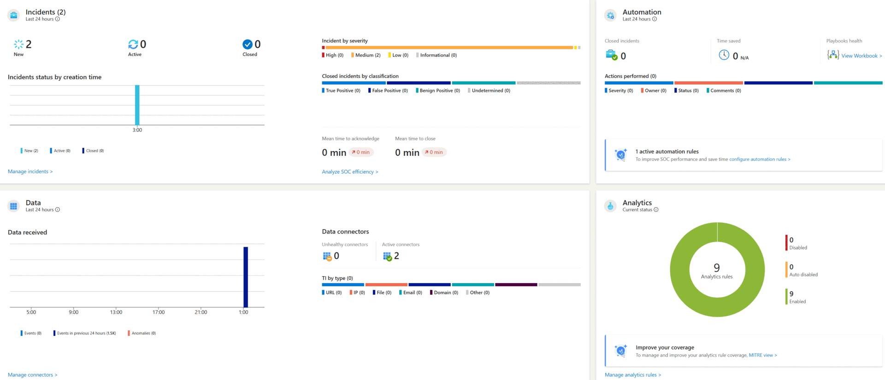
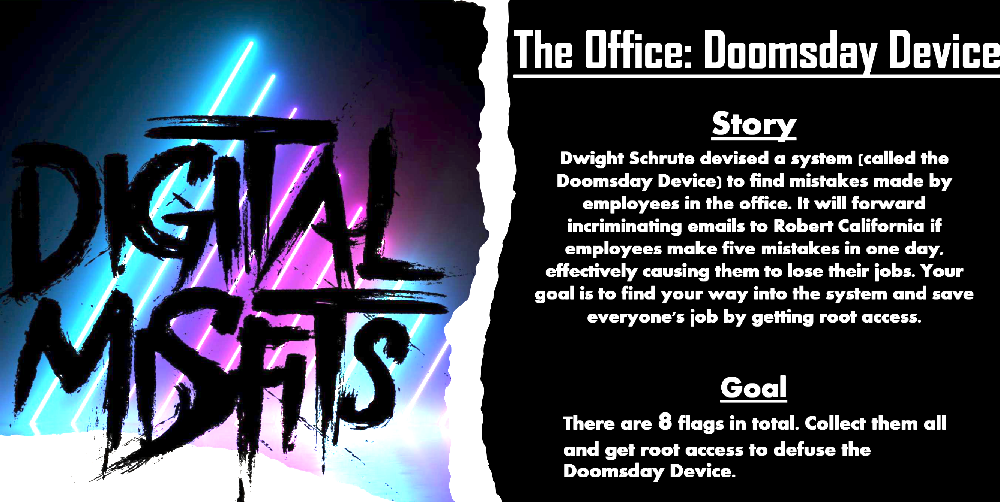
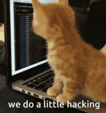

### **About Me**

Experienced cybersecurity professional with extensive expertise across various domains of cybersecurity and information security. Proven track record in delivering systems administration, penetration testing, and IT support services to a broad client base, ensuring robust security and seamless operations. Proficient in documenting and implementing compliance controls for CIS v8, SOC 2, GDPR, ISO 27001, and PCI DSS, resulting in successful audits and certifications. Specializes in cloud security and systems administration with proficiency in Microsoft 365 and Apple Business Essentials. Skilled in conducting REST API and GraphQL web application penetration testing, identifying vulnerabilities, and fortifying clients' security posture.

### **Skills**

- **Systems Administration:** Windows, Linux, MacOS, Android, iOS
- **Penetration Testing:** REST API, GraphQL, Web Applications
- **Compliance & Audits:** CIS v8, SOC 2, GDPR, ISO 27001, PCI DSS
- **Cloud Security:** Microsoft 365, Apple Business Essentials
- **Programming Languages:** Python, Golang, PowerShell
- **Tools:** Wireshark, Burp Suite Professional, pfSense, Snort, Nmap, Metasploit, Kali Linux, Nessus
- **Incident Response & Recovery** Microsoft Defender, Microsoft Sentinel, Jira
- **Identity Access Management** Microsoft Azure Active Directory, Microsoft Entra ID
- **Automation & Scripting** Python, Golang, PowerShell

### **Experience**

#### **Security Overview (Aug 2023 – July 2024)**
**Role:** Cybersecurity Analyst, Penetration Tester, Systems Administrator

- Delivered comprehensive systems administration, penetration testing, and IT support across Windows, Linux, macOS, iOS, and Android platforms, ensuring secure and efficient operations. Implemented security best practices and resolved hardware/software issues to protect client systems from emerging threats.
- Managed client endpoints and inboxes with Microsoft 365 (including Azure AD, Intune, Exchange, SharePoint, OneDrive, Defender, Teams) and Apple Business Essentials, including the creation, management, and deletion of user accounts. Enhanced productivity and security by implementing SAML/SSO, geo-location blacklisting, and Multi-factor Authentication (MFA) for secure sign-ins.
- Conducted contract-based and quarterly penetration tests, including REST API and GraphQL web applications, identifying vulnerabilities and enhancing clients' security postures. Leveraged OWASP Top 10 as a framework to identify 30+ server/client-side vulnerabilities, including DOM-based, stored, and reflected XSS, NoSQL injections, broken access controls (e.g., CSRF, open redirect, improper access controls), and other security misconfigurations.
- Implemented compliance controls for CIS v8, SOC 2, PCI DSS, GDPR, and ISO 27001, leading to successful client audits and certifications. Strengthened cloud environments with data loss prevention and conditional access policies.

#### **Proof of Reception (May 2023 – Present)**
**Role:** Prompt Engineer (Part-time Internship)

- Software Development Lifecycle (SDLC) experience, ability to collaborate and communicate and work effectively in a cross-functional team environment.
- Analyze code, remediate vulnerabilities, and improve overall application security.
- Optimize existing code, write new functions, and create artwork utilizing prompts using various large language models such as GPT-4, PaLM 2 and StableLM.
- Tools: ChatGPT, Google Bard, DALL-E, Stable Diffusion, Microsoft Copilot

### **Education**

#### **Woz-U, Cybersecurity**
- **GPA:** 4.0
- Completed a comprehensive cybersecurity program, gaining in-depth knowledge and hands-on experience in areas such as penetration testing, cloud security, compliance frameworks (CIS v8, SOC 2, GDPR, ISO 27001, PCI DSS), and incident response. Excelled in practical labs and projects, developing advanced skills in network security, vulnerability assessment, and secure systems administration.

### **Certifications**

- Woz-U Cybersecurity Certificate of Completion
- Google IT Support Professional
- IBM IT Support Professional
- IBM Cybersecurity Analyst Professional
- (ISC)² Certified in Cybersecurity
- Level 1 Intelligence Analyst Certification
- TryHackMe Advent of Cyber 2023
- The Complete Social Engineering, Phishing, OSINT, & Malware Certification
- Forensic Accounting and Fraud Examination
- OpenAI, GPT, ChatGPT, and DALL-E Masterclass
  

### **Projects**

#### **Microsoft Sentinel SIEM Deployment and Security Operations Center (SOC) Project**
**Description:** Designed and implemented a Security Operations Center (SOC) using Microsoft Azure, focusing on real-time threat detection and incident response.

**Key Components:**

- **Azure Virtual Machine Setup:** Deployed and configured a Windows-based virtual machine with RDP access for monitoring purposes.

- **SIEM Implementation:** Integrated Microsoft Sentinel as a SIEM solution to collect, analyze, and monitor security event logs.

- **Threat Intelligence Integration:** Configured a threat intelligence feed to detect and generate alerts for Indicators of Compromise (IoCs).

- **Event Logging and Alert Configuration:** Established data connectors and created custom alert rules to monitor successful RDP sign-ins and other critical security events.

- **Practical Experience:** Gained hands-on experience with real-time security monitoring, incident detection, and response within a simulated environment.

- **Technologies Used:** Microsoft Azure, Microsoft Sentinel, Log Analytics, Windows Server.

#### **The Office: Doomsday Device CTF Walkthrough**
**Description:** Conducted a comprehensive walkthrough of the CTF vulnerable machine "The Office: Doomsday Device," focusing on penetration testing, exploitation, and privilege escalation.

**Key Components:**

- **Reconnaissance & Information Gathering:** Utilized Nmap and netdiscover for initial network scanning to identify open ports and active services. Employed Gobuster and FFuF for directory and file enumeration, while leveraging Signal Squirrel to decode the messages encoded in morse code.

- **Vulnerability Analysis:** Analyzed service vulnerabilities using nmap & Wireshark. Inspected ".pcap" files with Wireshark to pinpoint the username and password found in cleartext.

- **Exploitation:** Exploited the identified vulnerabilities using a combination of creedGEN and hydra to brute force entry into the FTP service. Utlized Burp Suite to exploit the Koken CMS using a PHP reverse shell via a arbitrary file upload vulnerability using an image and connecting via netcat, leading to unauthorized access and a foothold on the machine.

- **Privilege Escalation:** Unlocked the SSH port using Knock. Leveraged SSH2John to crack the SSH key, and spawned an interactive shell resulting in privledge escalation. Uploaded "defuse.sh" bash script, resulting in earning the 8th and final flag.

- **Post-Exploitation & Reporting:** Secured sensitive data, maintained access, and documented the entire process with remediation steps and security recommendations.

- **Technologies Used:** Nmap, netdiscover, FFuF, Signal Squirrel, Burp Suite, creedGEN, Wireshark, MySQL, netcat, Exiftool, Knock, cat, nano, Gobuster, ftp, SSH2John, JohnTheRipper, LFTP, Hydra.

### **Contact Me**

Feel free to reach out to me if you'd like to discuss cybersecurity opportunities or any of the projects I've worked on. You can contact me via email or connect with me on LinkedIn using the links provided below.

- [https://www.linkedin.com/in/brandon-bennett~/](https://www.linkedin.com/in/brandon-bennett~/) 
- ### **bb.sec.op@protonmail.com** 

---
